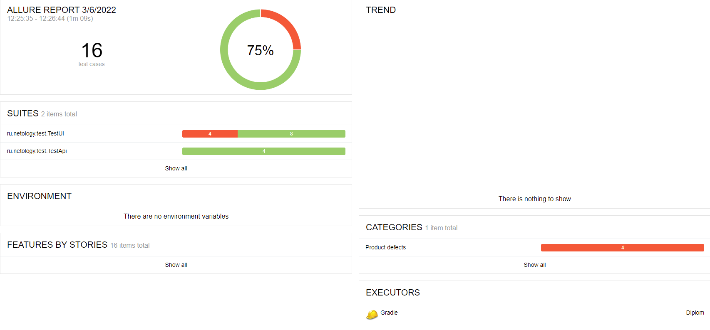

# Отчет по итогам тестирования
***
В ходе автоматизации реализованы:
* API тесты для подключения к БД MySQL и PostgreSQL.
* позитивные и негативные UI тесты

## Количество тест-кейсов:
Выполнено всего: 16 
* успешных 12 (75%)
* неуспешных 4 (25%)
В итоге: 75% успешно пройденных тестов
* 
## Отчёт Allure Report:

### Общие рекомендации:
* устранить возможность оплаты картой со статусом "DECLINED"
* настроить вывод более информативных сообщений пользователю при заполнении полей формы оплаты.